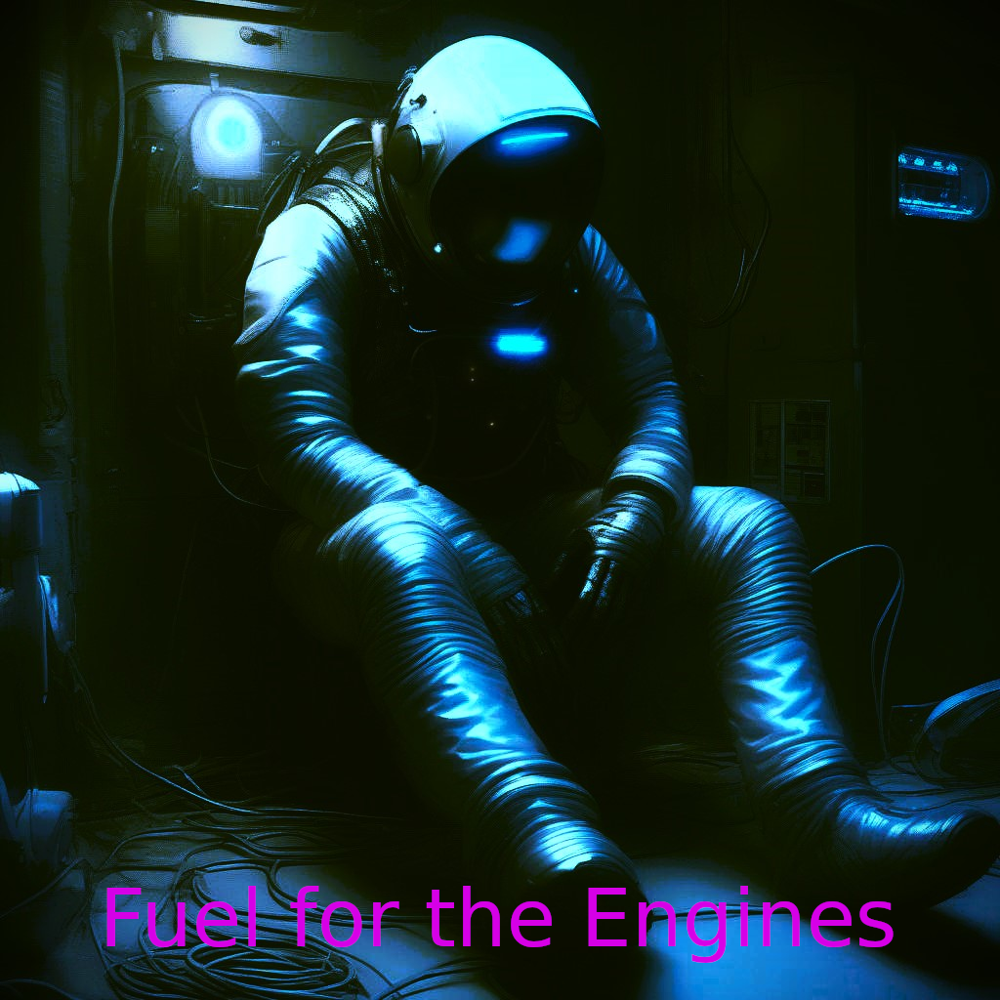

## Fuel For The Engines

The ship is slowly losing power, without power many important systems which the crew depend on will not function. You can feed fuel from your own suit to top up the ship, but this will reduce your own abilities unless you refuel yourself. There are many parasites on the ship, killing them will give you a bit more power.

Is it a psycological horror, a political satire, or just unpleasant to play?

### Controls

| Key | Command |
| --- | --- |
| <kbd>W</kbd> <kbd>A</kbd> <kbd>S</kbd> <kbd>D</kbd> | Movement |
| <kbd>Spacebar</kbd> | Jump |
| <kbd>Left mouse button</kbd> | Shoot |
| <kbd>T</kbd> | Switch weapon |
| <kbd>E</kbd> | Fuel the Engines |

Based on Kenney's "Starter Kit FPS" including various assets under [CC0 licensed](https://creativecommons.org/publicdomain/zero/1.0/)

## todo

* fix broken audio
* Better feedback of fuel and health
* Overall game balance
* Basic levels
* more abilites
* In-game naration and tutorialising
* Side-objectives
* Pretification
* plot?
* endgame?
* spoilers??
* 
